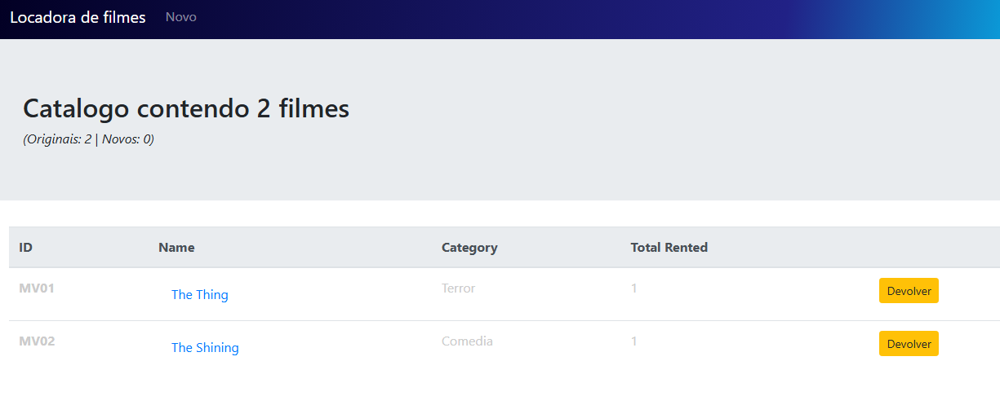

 
  

  &#xa0;

  <!-- <a href="https://vuejslocadorafilmes.netlify.app">Demo</a> -->

<h1 align="center">Vuejs Locadora Filmes</h1>

  

  

  

  

  <!--  -->

  <!--  -->

  <!--  -->

<!-- Status -->

<!-- <h4 align="center"> 
	🚧  Vuejs Locadora Filmes 🚀 Under construction...  🚧
</h4> 

 -->

  <a href="#dart-about">About</a> &#xa0; | &#xa0; 
  <a href="#rocket-technologies">Technologies</a> &#xa0; | &#xa0;
  <a href="#white_check_mark-requirements">Requirements</a> &#xa0; | &#xa0;
  <a href="#memo-license">License</a> &#xa0; | &#xa0;
  <a href="https://github.com/CristianoMCon" target="_blank">Author</a>

 

## :dart: About ##

Locadora de filmes em VueJS explorando recursos:
- routes
- localStorage

## :rocket: Technologies ##

The following tools were used in this project:

- [VueJS](https://vuejs.org/)

&#xa0;

<a href="#top">Back to top</a>
